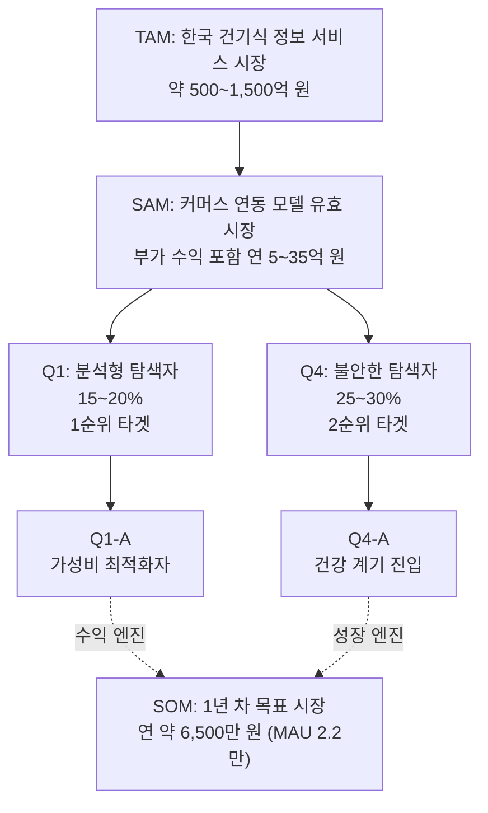
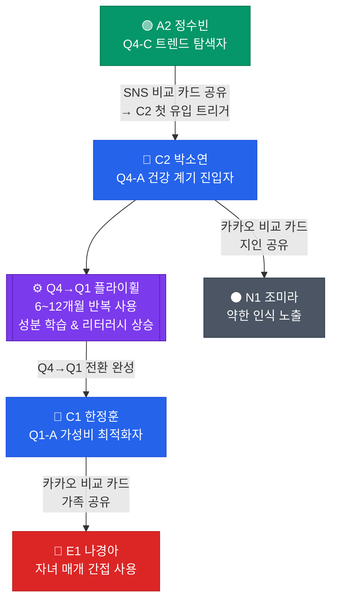
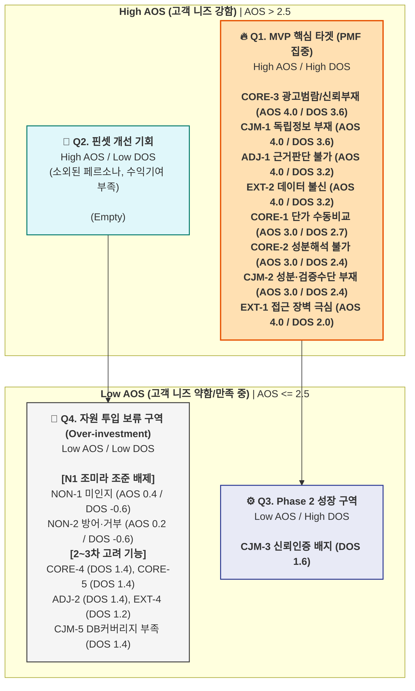
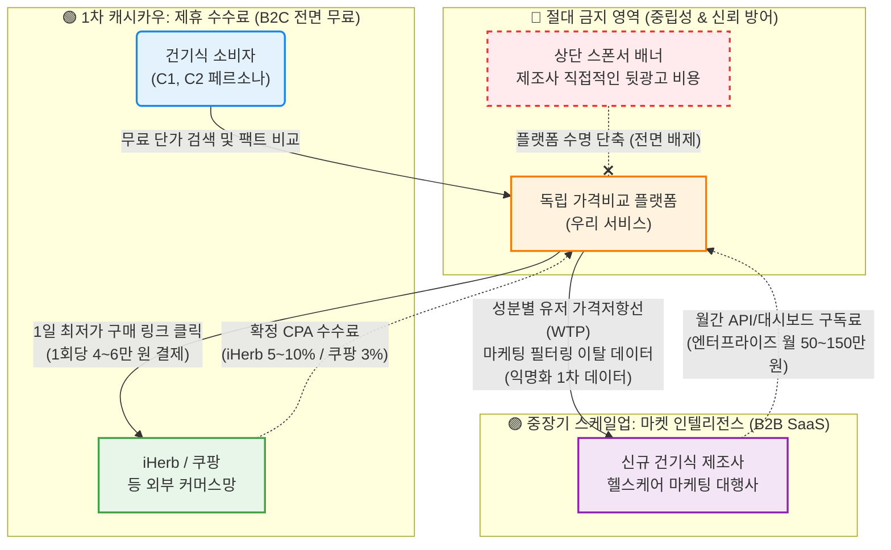

# 💡 Value Proposition Sheet — Merged V2

> **문서 버전:** Merged V2 (비즈니스 분석 통합본)
> **통합 원본:** `05_value-proposition-sheet_Merged_V1.md` + `01_Biz-Analysis/` 전체 리서치 문서 10건
> **작성 대상:** 건강보조식품 성분·가격 비교 플랫폼을 기획 중인 예비 창업자 및 초기 멤버
> **작성 목적:** 비즈니스 리서치(Porter's 5 Forces, 경쟁사 분석, 가치사슬, KSF, TAM-SAM-SOM, 페르소나, CJM, AOS-DOS, JTBD)를 직접 포함하여, *왜 이 시장인지, 누구에게, 어떤 본질적 가치를, 어떠한 차별성으로 제공하는지* 정의하고, 이를 실현하기 위한 MVP 개발 계획까지 **단일 문서로 관리**한다.

---

**🎯 엘리베이터 피치:** "수동 엑셀 계산과 뒷광고 필터링에 지친 건기식 소비자들을 위한, 리얼-타임 1일 단가 계산 및 의학 팩트체크 플랫폼"

**📣 포지셔닝 선언:** 우리는 마케팅 노이즈를 100% 제거하고 오직 **'1정당 찐 단가'** 와 **'식약처/논문 뱃지'** 만을 제공하는 시장 내 유일한 **독립(Neutral) 플랫폼** 이다.

---

## 📌 목차

| # | 섹션 | 내용 요약 |
|---|------|----------|
| Ⅰ | [Pain–Solution–Outcome 핵심 흐름도](#ⅰ-painsolutionoutcome-핵심-흐름도) | 고객 문제 → 솔루션 → 성과의 직관적 흐름 |
| Ⅱ | [타겟 & 문제 분석](#ⅱ-타겟--문제-분석) | 핵심 고객 정의 및 고통의 깊이 |
| Ⅲ | [AOS–DOS 결합 매트릭스](#ⅲ-aosdos-결합-매트릭스) | 페르소나별 Pain 수치화 및 시장 기회 산출 |
| Ⅳ | [JTBD 요약 카드](#ⅳ-jtbd-요약-카드) | 고객 Job 통합 및 핵심 Pain-Outcome 압축 |
| Ⅴ | [Value Proposition Sheet (핵심 가치 제안)](#ⅴ-value-proposition-sheet-핵심-가치-제안) | 솔루션 핵심 제안 총괄표 |
| Ⅵ | [수익 구조 설계](#ⅵ-수익-구조-설계) | Revenue Model & Monetization |
| Ⅶ | [전략적 제언](#ⅶ-전략적-제언) | 시니어 가치 분석가의 3가지 조언 |
| Ⅷ | [MVP 제품 비전 및 포지셔닝](#ⅷ-mvp-제품-비전-및-포지셔닝) | MVP 정의, 북극성 지표, Must-Have 스펙 |
| Ⅸ | [Job-Feature Map & MVP 기능 명세](#ⅸ-job-feature-map--mvp-기능-명세) | 기능 우선순위, 구현 난이도, 리스크 대응 |
| Ⅹ | [MVP 성공 측정 기준 & Next Steps](#ⅹ-mvp-성공-측정-기준--next-steps) | KPI 목표 및 팀별 실행 항목 |

---

## Ⅰ. Pain–Solution–Outcome 핵심 흐름도

우리 솔루션이 고객의 근본적 문제를 어떻게 해결하고 어떤 결과 가치를 창출하는지 보여주는 직관적 흐름입니다.

```mermaid
flowchart LR
    %% 스타일 정의
    classDef pain fill:#FFEbee,stroke:#EF5350,stroke-width:2px;
    classDef solution fill:#E8F5E9,stroke:#66BB6A,stroke-width:2px;
    classDef outcome fill:#E3F2FD,stroke:#42A5F5,stroke-width:2px;

    subgraph Pain ["🔥 Pain (고객의 불만/불안 지점)"]
        direction TB
        P1("1시간 낭비되는 엑셀 수동 단위 환산"):::pain
        P2("뒷광고로 도배된 영양제 리뷰 맹신 불가"):::pain
        P3("의학 용어와 정보 과잉으로 탐색 포기"):::pain
    end

    subgraph Solution ["💡 Solution (우리 플랫폼의 핵심 제안)"]
        direction TB
        S1("실시간 채널 통합 1일 단가 환산 엔진"):::solution
        S2("마케팅/제휴 제로의 독립적인 데이터 생태계"):::solution
        S3("의학 논문 기반 배지형 팩트 1탭 요약 카드"):::solution
    end

    subgraph Outcome ["🎯 Outcome (고객이 체감하는 최종 성과)"]
        direction TB
        O1("검색 5초 만에 신뢰도 100% 최저가 즉각 결제"):::outcome
        O2("지루한 성분 공부 해방 및 카카오톡 즉시 공유"):::outcome
        O3("마케팅 늪에서의 구원, 내 가족 건강의 보호"):::outcome
    end

    Pain ==> Solution ==> Outcome
```

---

## Ⅱ. 타겟 & 문제 분석

### 🏭 1. 시장 환경 — 왜 이 시장인가?

#### 1-1. 산업 트렌드 및 시장 환경 (문제 정의, Porter's 5 Forces 기반)

> **출처:** `1_porters-foreces.md`, `5_problem-definition.md`

국내 건강기능식품 시장은 연 **6조 원** 규모로 성숙기에 접어들었으나, OEM/ODM 인프라의 고도화로 인해 매년 수천 개의 신규 브랜드가 시장에 진입하며 **공급 과잉** 상태가 지속되고 있습니다.

| Porter's Force | 강도 | 핵심 분석 결과 |
|---|---|---|
| **기존 기업 간 경쟁** | 최상(Extreme) | OEM/ODM 발달로 수천 개 브랜드가 기능적 변별력 없이 쏟아져 나오며 Commoditization 심화. 네이버 쇼핑 등 포털 내 '검색 상위 노출'을 위한 과도한 마케팅 비용이 제품 가격에 전가되는 악순환 반복 |
| **신규 진입자 위협** | 매우 높음 | 콜마비앤에이치, 노바렉스 등 OEM 제조사가 직접 D2C 브랜드 런칭. 네이버·카카오가 자체 쇼핑 탭 내 비교 기능 고도화 시 단순 정보 제공 앱은 고사 위험. **전략적 해자:** 누구도 시도하지 않은 '제조원 기반 제품 클러스터링' 및 '성분당 단가 표준화' 데이터 선점이 유일한 방어선 |
| **구매자 교섭력** | 높음(→ 위임 발생) | 소비자의 정보 접근권은 높아졌으나, 브랜드별 상이한 표기법과 마케팅 용어로 **'비교할 수 있는 능력'**이 상실된 상태. 자신의 시간을 아껴줄 수 있는 **'신뢰할 수 있는 대리인(Agent)'**을 갈망 |
| **대체재 위협** | 높음 | 대형 약사 유튜버 추천 '조합' 맹목 추종, 홈쇼핑 스토리텔링+혜택 기반의 감정적 구매 등이 알고리즘 기반 비교 솔루션의 강력한 대체재 |
| **공급자 교섭력** | 중~높음 | 전통적 브랜드 제조사들이 '특허 성분', '개별인정형' 명목으로 가격 비교 불가능하도록 정보의 가림막 구축. 대응: 공급자의 마케팅 용어를 **'표준 성분 데이터'**로 환언(Translating)하는 역량 필수 |

> **5 Forces 종합 결론:** 시장은 '정보는 넘쳐나나 가치는 실전(失傳)된 혼돈 상태'. 경쟁자는 '제품 판매'에, 공급자는 '정보 가리기'에, 구매자는 '비교 노가다'에 지쳐 있다. 본 솔루션은 **"공급자의 복잡한 문법을 소비자의 직관적 언어(mg당 최저가, 제조원 일치 정보)로 재정리하는 정보 중개자(Market Refiner)"**로서 자리매김해야 한다.

#### 1-2. 경쟁사 분석 종합 (3개 도메인 Top 5)

> **출처:** `2_competents-analysis.md`

**🟢 도메인 1: 디지털 헬스케어 플랫폼**

| 기업/플랫폼 | 규모/지표 | 핵심 BM | 주요 전략 |
|---|---|---|---|
| **필라이즈** | 누적 120만+, 해외 80개국 | AI 기반 초개인화 건기식 추천 | 영양·식단·혈당 '슈퍼앱' 포지셔닝 |
| **핏타민** | 약사 상담 경험치 최상위 | 빅데이터 문진 + 약사 화상 상담 구독 | O2O 하이브리드 |
| **아이엠(IAM)** | MZ세대 77% 비중 | AI 알고리즘 맞춤 소분 D2C | 이마트 등 옴니채널 경험 |
| **알고케어** | 대기업 B2B 수주 | IoT 디스펜서 융합 서비스형 영양 구독 | 가정/회사 내 락인(Lock-in) |
| **필리** | 누적 설문 94만+, 정기구독 4.5만 | 설문 기반 1:1 추천 구독 앱 | 자체 PB 상품 직판매 집중 |

**🔵 도메인 2: 이커머스 및 직구(가격비교) 시장**

| 기업/플랫폼 | 규모/지표 | 핵심 BM | 주요 전략 |
|---|---|---|---|
| **아이허브(iHerb)** | 순매출 24억 USD, 180개국 | 5만 개 건기식 DTC 직구 생태계 | 글로벌 추천인 리워드 바이럴 |
| **쿠팡 직구** | 자사 물류 인프라 1위 위협 | 로켓와우 멤버십 연계 통관 간소화 | 단순 무결점 쇼핑 경험 |
| **오플닷컴** | 직구족 인지도 상위 | 메이저 브랜드 100% 직매입 D2C | 현지법인 CS, 최저가 선점 |
| **비타트라** | 건기식 직구 거래 주요 허브 | 프리미엄 큐레이션 쇼핑몰 | 트렌드 상품 선제 등재 |
| **네이버 쇼핑** | 거대 포털 트래픽 엔진 | 멤버십 락인 + 오픈마켓 최저가 중개 | 셀러들의 자발적 가격 출혈 유발 |

> **핵심 시사점:** 이커머스 빅테크와의 정면 승부는 불가. **'에셋 라이트(Asset-Light)' 모델**로 제휴 API 모듈 기반 딥링크 라우팅(커머스 연동 수수료)을 1차 BM으로 삼고, 전환 비용을 창출하는 '결제 여정 통합 UX'를 구축해야 한다.

**🟠 도메인 3: 전통 건기식 제조 및 핵심 브랜드**

| 기업/브랜드 | 규모/지표 | 핵심 BM | 주요 전략 |
|---|---|---|---|
| **KGC인삼공사** | 연 1.3조, 국내 점유 1위 | 수백 개 로드샵(O2O) + D2C | 기능 특화 특허 개발 + B2B 파운드리 |
| **종근당건강** | 락토핏 단일 누적 1조 | 홈쇼핑·대형마트 융단 폭격 유통 | 스마트공장 원가절감 + 가성비 마케팅 |
| **동아제약** | 오쏘몰 단일 1천억 매출 캐리 | 오쏘몰 독점 수입 D2C | 이중 제형 럭셔리 + 카카오 선물 1위 |
| **콜마비앤에이치** | 약 6천억, 연 7천억 생산 | 국내외 Top 브랜드 ODM 생산 | 독점 신소재(개별인정형 특허) 역제안 |
| **노바렉스** | 300여 메이커 위탁 파트너십 | 원스톱 특화 소재 기반 R&D | 47개 독점 특허로 강력 마진 실현 |

#### 1-3. 가치사슬(Value Chain) 설계 및 핵심 성공 요인(KSF)

> **출처:** `3_value-chain.md`, `4_ksf-report.md`

**가치사슬 주요 활동 설계:**

| 주요 활동 | 설계 방향 | 경쟁 우위 확보 방안 |
|---|---|---|
| **조달 물류** | 식약처 공공 데이터 및 이커머스 가격 API 연동. 실질 제조원(OEM) DB 구축 | **성분-제조원 클러스터링:** '이름만 다른 똑같은 제품' 자동 분류 파이프라인 |
| **운영** | 마케팅 용어 → 표준 성분명 변환 '정제 엔진'. mg당 단가 표준화 계산 로직 | **가성비 스코어링:** 원산지·제조원 숙련도·함량 종합 '리파인 지수' 알고리즘 |
| **출하 물류** | 모바일 앱 상시 가격 비교 대시보드. 이커머스 딥링크 연동 | **최적 장바구니 엔진:** 관세+배송비 포함 '오늘의 실지불가' 자동 산출 |
| **마케팅/영업** | '마케팅 거품 걷어내기' SNS 캠페인. 전문가 검증 콘텐츠 | **투명성 기반 커뮤니티:** 유저 직접 제보+검증받는 Crowd-sourced 정보 정제 생태계 |
| **서비스** | 유료 구독 '성분 상성·부작용 알림'. 1:1 맞춤 포트폴리오 상담 | **전문가 매칭 솔루션:** 상담 시 정제된 데이터를 SaaS로 제공하여 객관성 확보 |

**가치사슬 핵심 가치창출 요인:**
1. **제조원 기반의 신뢰 자산:** 브랜드 이면의 '진짜 생산자' 정보 공개 → 정보 비대칭성 해소
2. **에셋 라이트(Asset-Light) 수익 구조:** 직접 재고 보유 없이 정보 중개와 제휴 수수료로 수익 → 물류 리스크 없이 확장성 극대화

**Top 5 핵심 성공 요인 (KSF):**

| 순위 | KSF | 근거 출처 |
|---|---|---|
| 1 | **제조원 기반 제품 클러스터링 및 데이터 표준화 역량** | 5 Forces '신규 진입자의 위협' + 가치사슬 '조달 물류' |
| 2 | **정보 피로도를 해소하는 '신뢰할 수 있는 대리인(Agent)' 포지셔닝** | 5 Forces '구매자의 교섭력' + 가치사슬 '마케팅 및 영업' |
| 3 | **에셋 라이트 중개 모델 및 어필리에이트 생태계 구축** | 가치사슬 '종합 분석 결과' + 5 Forces '기존 기업 간의 경쟁' |
| 4 | **공급자 마케팅 용어를 표준 데이터로 '환언(Translating)'하는 기술력** | 5 Forces '공급자의 교섭력' + 가치사슬 '운영' |
| 5 | **구매 전환 비용 창출하는 '결제 여정 통합 UX'** | 가치사슬 '핵심 가치창출 요인' |

#### 1-4. 시장 규모 (TAM-SAM-SOM)

> **출처:** `6_TAM-SAM-SOM+MarketSegment.md`

| 구분 | 규모 | 근거 |
|---|---|---|
| **TAM** (한국 건기식 정보 시장 전체) | **500~1,500억 원** | 글로벌 TAM 10~25억 USD의 한국 비중. Top-down × Bottom-up 교차 검증 |
| **SAM** (커머스 연동 모델, 부가 수익 포함) | **5~11억 원/년** | 기본 시나리오, 인지도 확보 전제 |
| **SOM** (1년 차 획득 가능 시장) | **0.5~1.0억 원/년** | MAU 2~6만 명 달성 기준 추정 |

**소비자 행동 핵심 지표 (공개 조사 데이터):**

| 지표 | 수치 | 출처 | 검증 수준 |
|---|---|---|---|
| 건기식 구매 전 온라인 탐색 비율 | 72% | 한국건강기능식품협회 (2023) | ✅ 공개 조사 |
| 평균 탐색 시간 | 30~60분 | 협회 조사 + 업계 추정 | ⚠️ 간접 추정 |
| 구매 여정 ③~④ 단계 이탈률 | 55~75% | 복수 소스 교차 추정 | ⚠️ 간접 추정 |
| 동일 성분 기준 가격 차이 | **최대 8.2배** | 한국소비자원 (2022) | ✅ 공개 조사 |
| 가격-품질 오인 비율 | **41.3%** | 식약처 소비자 인식조사 (2021) | ✅ 공개 조사 |
| 3개 이상 제품 비교 후 구매 비율 | 58% | Nielsen Korea (2022) | ✅ 공개 조사 |
| 연간 온라인 건기식 거래액 | 3.7~4.1조 원 | 협회 자료 + 추정 | ⚠️ 추정 포함 |

**전략적 인사이트 — 시장 가설 검증 강도:**

| 문제의식 | 검증 강도 | 핵심 데이터 |
|---|---|---|
| P1. 시장 존재성 | ██████████ **강함** | 글로벌 ConsumerLab·Labdoor 등 독립 플레이어 존재 확인(🟢) |
| P3. 수요 근거 | █████████░ **강함** | 성분 비교 어려움 47.2%, 동일 성분 가격 차이 8.2배(🟢) |
| P2. 시장 규모 | █████░░░░░ **중간** | TAM 범위 추정 가능, ±50% 오차(🟡) |
| P4~P8. How | ███░░░░░░░ **약함** | 타겟 선정, 전환율, 수익 모델 실측 필요(🔴) |

> **"왜(Why)"는 강하고, "어떻게(How)"는 아직 가설이다.** → MVP를 통한 P4(타겟 검증), P6(수익 모델 실측), P8(기술 PoC)에 리소스를 집중해야 한다.

---

### 🎯 2. 타겟 — 누구를 위한 것인가?

> **출처:** `7_persona-spectrum-map.md`

저희 비즈니스는 **전체 1,200만 건기식 커머스 시장 내에서 가장 구매 관여도가 높은 2개의 핵심 그룹(SOM)** 의 문제를 풉니다.

#### 페르소나 스펙트럼 전체 구조

| 유형 | 페르소나 | 세그먼트 | 역할 | 추정 모수 |
|---|---|---|---|---|
| **🔵 핵심(Core)** | **C1 한정훈** (36, 개발자) | Q1-A 가성비 최적화자 | 1년 차 SOM **수익 엔진** | 100~150만 명 |
| **🔵 핵심(Core)** | **C2 박소연** (43, 인사팀 과장) | Q4-A 건강 계기 진입자 | 1년 차 SOM **성장 엔진** | 130~240만 명 |
| **🟢 확장(Adjacent)** | **A2 정수빈** (27, 뷰티 마케터) | Q4-C 트렌드 추종 탐색자 | **SEO·콘텐츠 트래픽 유입** | 94~135만 명 |
| **🔴 극단(Extreme)** | **E1 나경아** (62, 은퇴 교사) | Q4-A 극단 — 디지털 약자 | 접근성 설계 기준 | 350~430만 명 |
| **🔴 극단(Extreme)** | **E2 김도현** (29, 데이터 분석가) | Q1-A 극단 — 신뢰 실패자 | 데이터 정확도·신뢰 SLA 기준 | — |
| **⚫ 비활성(Non-user)** | **N1 조미라** (58, 경리) | Q3 수동적 수용자 | 진입 장벽·시장 확장 한계 | 525~800만 명 |

**핵심 페르소나 상세:**

**C1 한정훈 — "엑셀 비교왕"**

| 항목 | 내용 |
|---|---|
| **주요 문제** | iHerb(달러)·쿠팡(원)·네이버를 탭 8개 열어놓고, 환율 적용 함량당 단가를 스프레드시트에 직접 기록해 비교. 제품 한 종의 용량별(60정/120정/240정) 단가 나눗셈에만 20분. 할인·쿠폰·적립금까지 반영시 복잡도 기하급수적 상승. |
| **목표** | "같은 비타민D 1,000IU면, 지금 이 순간 어느 채널이 가장 싼지 5초 안에 알고 싶다." |
| **감정** | 비교 자체는 즐기지만, 반복적인 수동 계산에 **피로감**. "이걸 자동화해주는 도구가 왜 없지?" |
| **대체 솔루션** | 개인 구글 스프레드시트 (환율 계산식 직접 구성), 에누리 건강플러스(부분적), iHerb 내 정렬 기능 |

**C2 박소연 — "검진 후 첫 구매자"**

| 항목 | 내용 |
|---|---|
| **주요 문제** | 건강검진 비타민D 부족 판정. "콜레칼시페롤 25μg"이 좋은 건지 나쁜 건지 모름. 5,000~50,000원 10배 차이에 상반된 정보가 쏟아져 불안. 45~90분 탐색에도 결론 못 내고 베스트셀러로 타협하지만 찝찝함. |
| **목표** | "의사가 부족하다고 한 그 성분을, 적정 가격에, 안전한 제품으로 사고 싶다. 30분 안에." |
| **감정** | 건강 **경각심과 불안** 공존. 탐색할수록 **혼란과 무력감** 확대. 납득할 수 있는 설명을 받으면 즉각 강한 신뢰 형성. |
| **대체 솔루션** | 네이버 블로그·카페 후기, 약사 유튜버, 약국 방문 상담, 쿠팡 베스트셀러 순 정렬 |

> **배제 타겟:** E1(디지털 소외), N1(브랜드 맹신러) — MVP 단계 마케팅/기획 자원 투입 전면 금지. 데이터(DOS)가 증명하는 과잉 투자 구간.

---

### 📉 3. 문제의 깊이 — 고객 여정(CJM)에서 드러나는 Pain

> **출처:** `8_customer-journey-map.md`

**CJM 단계별 핵심 Pain Point — 전 페르소나 교차 분석:**

| CJM 단계 | 가장 큰 공통 Pain | 해당 페르소나 | 개선 기회 |
|---|---|---|---|
| **인지** | 광고성 정보와 독립 정보의 구분 불가 | C2, A2 | SEO 콘텐츠 선점 + "광고 아님" 정체성 명확화 |
| **고려** | 성분 이해 불가 + 데이터 검증 수단 없음 | C2, E2, E1 | 일상어 번역 + 출처 투명 공개 |
| **결정** | 마지막 신뢰 확인 수단 없음 | C1, E2, A2 | 독립 평가 배지 + 오류 신고 기능 |
| **온보딩** | 이력 미저장으로 재방문 시 초기화 | C1, C2 | 비교 이력 저장 + 재방문 연속성 |
| **충성도** | DB 커버리지 한계로 이탈 | C1, A2 | 제품 DB 확장 + 사용자 요청 등록 |

**페르소나별 여정 핵심 가치:**

| 페르소나 | 여정 핵심 가치 | 감정 곡선 |
|---|---|---|
| **C1** | "40분짜리 스프레드시트 작업을 3초로" | 반신반의 → 비판적 집중 → **즉각 확신** → 루틴 정착 |
| **C2** | "처음 사는 사람도 30분 안에 확신을 갖고 결정" | 불안·혼란 → 기대 반 불안 반 → 조심스러운 안도 → **자신감·전도사** |
| **A2** | "트렌드 성분이 진짜인지 5초 팩트체크, 결과는 1탭 공유" | FOMO·의심 → 납득 → **만족·공유 충동** → 전도사 |
| **E2** | "데이터 출처를 2클릭 안에 추적 가능, 오류는 48시간 내 수정" | 냉소 → 비판적 검증 → 제한적 신뢰 → **신뢰 갱신** → 고신뢰 충성 |

**플랫폼 성장 플라이휠:**

---

### 🚀 4. MVP 핵심 방향

우리의 MVP는 완벽한 헬스케어 슈퍼앱이 아닙니다. 고객의 **탐색 비용을 60분에서 5초로 압축**하는 단 두 가지 압도적인 '초자동화' 기능만 던집니다.

- **[HFF-Hub 엔진]:** Health Functional Food Hub, 직구 달러 환율부터 상이한 묶음 용량까지 파싱하여, 오직 **"1일 복용 기준 원화(₩) 최종 단가"** 하나로만 수직 정렬해버리는 채널 통합 가격 비교 API.
- **[Anti-BS 대시보드]:** 유저의 의사결정을 흐리는 체험단 블로그 잡음과 평점을 UI에서 100% 삭제하고, **식약처 DB 및 논문 근거에 기반한 '단 1개의 의학 뱃지(결론)'** 만 제공.
- **(수익화):** 아웃링크 기반의 **제휴 수수료(iHerb 5~10%, 쿠팡 3%)** 를 수취하여, 어떠한 브랜드 협찬 광고 없이도 자생할 수 있는 플라이휠을 구동합니다.

---

## Ⅲ. AOS–DOS 결합 매트릭스

> **출처:** `9_aos-dos-analysis.md`

### 1. 페르소나별 Pain 수치화 및 AOS 산출

**AOS 산출 공식:** `Importance × (1 - Satisfaction / 5)` *(Likert 5점 척도 기준)*

| 그룹 구분 | 페르소나 유형 | Pain ID | 핵심 Pain 내용 | Imp | Sat | AOS | 해석 |
| --- | --- | --- | --- | --- | --- | --- | --- |
| **🔵 핵심** | **C1 한정훈** (가성비) | CORE-1 | 채널 간 단가 비교 수동 작업 과부하 | 5 | 2 | **3.00** | 높은 중요도 대비 자동화 대안 부재 |
|  | **C2 박소연** (건강계기) | CORE-2 | 성분 정보 해석 불가 → 비교 불가 | 5 | 2 | **3.00** | 성분 리터러시 장벽으로 탐색 중단율 높음 |
|  | **C2 박소연** (건강계기) | CORE-3 | 광고성 콘텐츠 범람, 신뢰 정보 부재 | 5 | 1 | **4.00** | 독립 비교 플랫폼 가치의 핵심 |
|  | C1/C2 공통 | CORE-4 | 가격 적정성 판단 기준 부재 | 4 | 2 | **2.40** | 결제 전 막연한 찝찝함 유발 |
|  | C2 중심 | CORE-5 | 장시간 탐색에도 확신 있는 결론 실패 | 4 | 2 | **2.40** | 탐색을 포기하고 베스트셀러로 타협함 |
| **🟢 확장** | **A2 정수빈** (트렌드) | ADJ-1 | 트렌드 성분 과학적 근거 판단 불가 | 5 | 1 | **4.00** | 바이럴을 지탱할 팩트체크 부재 |
|  | **A2 정수빈** (트렌드) | ADJ-2 | 광고/진짜 구분 불가 + 가격 차이 근거 | 4 | 2 | **2.40** | 8배 가격 차이에 대한 납득 원함 |
|  | **A2 정수빈** (트렌드) | ADJ-3 | FOMO 충동 구매 → 후회 반복 | 3 | 2 | **1.80** | 예방적 정보이나 긴급도 다소 낮음 |
| **🔴 극단** | **E1 나경아** (디지털약자) | EXT-1 | 디지털 인터페이스 접근 장벽 | 5 | 1 | **4.00** | 자발적 진입 불가, 카카오톡 의존 |
|  | **E2 김도현** (신뢰실패) | EXT-2 | 데이터 오류 → 카테고리 전체 불신 | 5 | 1 | **4.00** | 수익엔진 C1 이탈과 직결됨 |
|  | **E1 나경아** (디지털약자) | EXT-3 | 수동 검증/홈쇼핑 의존 복귀 | 4 | 3 | **1.60** | 기존 오프라인 방식에 만족도가 있음 |
|  | **E2 김도현** (신뢰실패) | EXT-4 | 오류·불편의 부정적 확산 | 4 | 2 | **2.40** | 플랫폼 평판 리스크 |
| **⚫ 비활성** | **N1 조미라** (브랜드맹신) | NON-1 | 저가 제품 미인지 + 가격-품질 오인 | 2 | 4 | **0.40** | 현 방식에 고만족, 전환 매우 낮음 |
|  | **N1 조미라** (브랜드맹신) | NON-2 | 정보 방어·거부 + 탐색 니즈 부재 | 1 | 4 | **0.20** | 무탐색자 대상으로 유입 투자 불필요 |
| **CJM 공통** | 전 여정 | CJM-1 | [인지] 광고 vs 독립 정보 구분 불가 | 5 | 1 | **4.00** | SEO 최초 진입 시 신뢰 확보 |
|  | 전 여정 | CJM-2 | [고려] 성분 이해 불가 + 검증 없음 | 5 | 2 | **3.00** | 일상어 번역 필수 요구됨 |
|  | 전 여정 | CJM-3 | [결정] 마지막 신뢰 확인 수단 없음 | 4 | 2 | **2.40** | 독립 평가/오류 신고 배지로 해결 |
|  | 전 여정 | CJM-4 | [온보딩] 이력 미저장 → 재방문 초기화 | 3 | 2 | **1.80** | 리텐션 저해하나 초기에는 치명적 아님 |
|  | 전 여정 | CJM-5 | [충성도] DB 커버리지 한계 | 4 | 2 | **2.40** | 장기 사용 시 파워유저 이탈 유발 |

### 2. Satisfaction 핵심 발견

> Satisfaction 1점 = **시장 공백** 5개 항목 — 독립 비교 플랫폼 부재(CORE-3), 과학적 근거 등급 서비스 전무(ADJ-1), 고령자 접근성 설계 전무(EXT-1), 데이터 투명성 시스템 전무(EXT-2), 인지 단계 독립 정보 부재(CJM-1). **이 5개가 AOS 최고 득점 후보이자 사실상 대체 솔루션이 존재하지 않는 시장 공백.**

### 3. DOS (시장 기회) 산출

**DOS 산출 공식:** `AOS × Market Relevance (MR)`

| 세그먼트 | 예상 모수 규모 추정 | 전략적 시장 비중 기여도 |
| --- | --- | --- |
| **Q1-A (C1)** | 100만 ~ 150만 명 | **시장수익 엔진(55%)**. MVP 직결, 가장 높은 전환율 |
| **Q4-A (C2)** | 130만 ~ 240만 명 | **시장성장 엔진**. Q1 전환을 위한 자발적 탐색가 |
| **Q4-C (A2)** | 94만 ~ 135만 명 | **트래픽 확보**. SEO 유입 주축 |
| **Q4-극단 (E1)** | 350만 ~ 430만 명 | 모수 최대이나 직접 플랫폼 채택 난이도 극상 |
| **Q3 (N1)** | 525만 ~ 800만 명 | 시장의 40% 이상. 전환율 0 (방어성향) |

| 순위 | Pain ID | 페르소나 분류 | AOS | MR | DOS | 대상 세그먼트 시장성 종합 평가 |
| :--- | :--- | :--- | :--- | :--- | :--- | :--- |
| **1** | **CORE-3** | 🔵 핵심 (C2, C1) | 4.00 | **0.9** | **3.60** | Q1-A + Q4-A 100% 포괄. 전환의 첫 번째 조건 |
| **1** | **CJM-1** | 전 여정 (SEO 인지) | 4.00 | **0.9** | **3.60** | 신규 트래픽의 모든 유입 채널 대응 |
| **3** | **ADJ-1** | 🟢 확장 (A2) | 4.00 | **0.8** | **3.20** | Q4-C 트래픽 규모(트렌드 검색량 폭증) 방어 |
| **3** | **EXT-2** | 🔴 극단 (E2, C1) | 4.00 | **0.8** | **3.20** | C1(수익엔진)의 리텐션을 유지하기 위한 SLA |
| **5** | **CORE-1** | 🔵 핵심 (C1) | 3.00 | **0.9** | **2.70** | MVP 수수료 모델(SAM/SOM)의 55% 수익 직결 |
| **6** | **CORE-2** | 🔵 핵심 (C2) | 3.00 | **0.8** | **2.40** | Q4-A 탐색의 최초 허들. 여기서 통과 못하면 전환 0% |
| **6** | **CJM-2** | 전 여정 (고려 단계) | 3.00 | **0.8** | **2.40** | 미드퍼널 비교 도구 부재 해소 |
| **8** | **EXT-1** | 🔴 극단 (E1) | 4.00 | **0.5** | **2.00** | 모수 400만 이상이나 직접 결제 확률 매우 낮아 MR 저감 |

### 4. AOS-DOS Combined Matrix 시각화

> **해석 기준:** X축(DOS)은 시장의 실질적 파급력. Y축(AOS)은 유저가 느끼는 결핍 강도. 두 점수가 모두 AOS 2.5 / DOS 1.5를 넘기는 `Q1 혁신 기회 영역`이 MVP의 필수 요구사항.

### 5. 매트릭스 시사점

1. **N1 조미라 타겟 배제의 데이터적 승인:** 비활성 페르소나 N1은 모수가 500~800만 명(가장 큰 시장 체적)임에도 Satisfaction이 과도하게 높아 AOS가 0.4 이하. DOS 값 `-0.60`으로 귀결되어, 이 층을 플랫폼 유입 기법으로 끌어들이려는 노력은 과잉 투자.
2. **C1 한정훈 기능의 최상위 중요성 입증:** `CORE-1(단가 비교 자동화)`는 AOS 3.0이나, MR 0.9를 곱할 시 DOS 2.70으로 상위권 핵심 MVP 필수 기능에 랭크.
3. **E2 김도현 SLA 가이드라인의 MVP 위상:** `EXT-2(데이터 불신)`의 해결은 통상 백엔드 유지보수로 간주되나, AOS 4.0 / DOS 3.2를 동시 달성하여 UX 기획 단계에서부터 우선 도입해야 하는 핵심 요구사항 반열.
4. **AOS 최고 ≠ DOS 최고:** EXT-1(디지털 장벽)은 AOS 4.0이지만 DOS 2.0. 고객 니즈는 절박하나 시장 수익 연결이 간접적 → Phase 2로 배치.
5. **DOS가 AOS 순위를 역전하는 항목:** CORE-1(채널 단가 비교)는 AOS 3.0으로 중위권이지만 DOS 2.70으로 상위. SOM 수익 55% 직결이라 시장 가중치가 높음.

---

## Ⅳ. JTBD 요약 카드

> **출처:** `10_jtbd-interview-report.md`

### 🃏 Card 01. 가성비 & 단가 최적화 그룹 (C1)

> **"수동 엑셀 계산을 영원히 해고(Fire)하고 싶다"** — 대상 페르소나: **C1 (한정훈)**

| 항목 | 요약 |
| --- | --- |
| **💡 통합 Job** | 환율, 배송비, 할인코드가 실시간 반영된 **정확한 1일 복용량 단위 단가**를 빠르게 찾아내어 최적의 시점에 구매하는 것. |
| **🔥 핵심 Pain** | **계산 과부하 & 타이밍 실패** — iHerb/쿠팡 등 채널별 용량, 환율, 복용량을 대조하며 엑셀로 수동 계산하는 것에 1시간 이상 소요. 최저가를 기껏 계산해두면 그새 품절되거나 할인이 끝남. *"엑셀에 달러치고 나눗셈 하다보면 현타옵니다."* |
| **🎯 Outcome** | **계산 시간 90% 압축 (1시간 → 5초)** — 실시간 반영된 최종가 + 비교 데이터를 한눈에 확인하여 즉시 결제 완료. |

**JTBD 4 Forces 분석:**

| Force | 내용 |
|---|---|
| **Push (기존의 밀어내는 힘)** | 매번 엑셀을 켜야 하는 수작업의 피로감. 1시간 계산 후 품절이면 현타. |
| **Pull (새 솔루션의 끌어당기는 힘)** | 수동 계산을 완벽히 대체하는 1클릭 환산 엔진 |
| **Habit (관성의 저항)** | 손에 익은 구글 시트 단축키 패턴 |
| **Anxiety (새것에 대한 불안)** | 앱 결제창 금액이 엑셀로 직접 계산한 것보다 비쌀까 봐 우려 |

### 🃏 Card 02. 안심 검증 & 바이럴 그룹 (C2, A2 통합)

> **"광고와 공구의 늪을 벗어나, 딱 떨어지는 결론만 고용(Hire)하고 싶다"** — 대상 페르소나: **C2 (박소연), A2 (정수빈)**

| 항목 | 요약 |
| --- | --- |
| **💡 통합 Job** | 영양제 탐색 시 광고를 배제하고 **객관적/의학적 팩트만 필터링**하여, 본인 결정을 확신하고 타인에게 **자신 있게 공유**하는 것. |
| **🔥 핵심 Pain** | **정보 공해 & 해석 의지 부족** — 모든 정보가 '뒷광고'나 '협찬'으로 뒤덮여 진위 식별 불가. *"광고인지 아닌지만 감별해 주는 판독기가 필요해요."* (A2) |
| **🎯 Outcome** | **광고 수익 0 인증 & 의학 뱃지 시스템** + 결론 요약 카드를 **1 탭**만으로 SNS 및 가족 카톡방에 전달. |

**JTBD 4 Forces 분석:**

| Force | 내용 |
|---|---|
| **Push** | C2: 블로그 광고 + 성분 용어 난해 → 극도의 피로+불안. A2: 인플루언서 추천 제품 비싼 돈 → 후회 |
| **Pull** | 의학적 근거로만 정렬된 안심 데이터 환경. "당뇨 환자 주의"·"임상 결과 확실" 같은 명확한 결론 뱃지 |
| **Habit** | C2: 결국 대형 제약사/지인 추천 상위 구매. A2: 일단 유행이면 품절 전 지르고 보는 관성 |
| **Anxiety** | 이 팩트체크 정보조차 저격 마케팅(뒷광고)의 일환일까 의심 |

### 🃏 Card 03. 무결점 데이터 & 신뢰 그룹 (E2)

> **"오직 투명한 데이터 원본만이 내 신뢰를 얻을 수 있다"** — 대상 페르소나: **E2 (김도현)**

| 항목 | 요약 |
| --- | --- |
| **💡 통합 Job** | 왜곡된 플랫폼 스펙이 아닌, **실물 제품의 정확한 스펙(라벨 원본)을 교차 검증**하여 피해 없이 구매하는 것. |
| **🔥 핵심 Pain** | **기존 비교 시스템의 데이터 오류 혐오** — 과거 앱에서 '1회 섭취량' 기준 오안내로 비싼 제품을 구매했던 경험 → 카테고리 전체 불신. |
| **🎯 Outcome** | 비교 결과 옆에 **'식약처/제조사 원본 라벨' 바로보기 연동** + 오류 발견 시 48시간 내 수정 및 제보자 보상 체감. |

### 🚫 번외. 리소스 제외 그룹 (E1, N1)

- **E1 나경아 (디지털 소외):** 디지털 앱 사용 자체가 불가능. C2가 보내주는 카카오톡 공유 수신 기능으로 우회 접근.
- **N1 조미라 (브랜드 맹신):** 기존 브랜드를 무지성 선호. 전환 유인이 0%이므로 타겟에서 완전 배제.

### JTBD 인터뷰 핵심 인사이트 3대 발견

> **출처:** `10_jtbd-interview-report.md` — 6명 심층 인터뷰 결과

1. **[C1의 스위칭 임계점]** 엑셀의 복잡함보다는 **'데이터의 실시간성'**이 전환(Switch)의 핵심. 수동 계산의 피로와 실시간 반영 실패가 만나는 지점이 서비스 고용(Hire)의 강력한 트리거.
2. **[C2/A2의 정보 해독 욕구]** 정보의 양보다는 **'필터링된 결론'**을 원함. 의학적 근거를 '공부'하려는 게 아니라, 전문가가 '검사 완료'해 준 결과물만 취하고 싶어 하는 경향이 매우 강함.
3. **[신뢰의 척도: 뒷광고 원천 차단]** 모든 페르소나가 공통으로 '특정 업체와의 유착'을 가장 우려. 플랫폼이 지속되려면 **'독립적인 팩트 체크'** 이미지 고수가 BM보다 우선시되어야 함.

---

## Ⅴ. Value Proposition Sheet (핵심 가치 제안)

| 항목 | 내용 요약 | 상세 서술 |
| --- | --- | --- |
| **고객별 핵심 문제 (Pain)** | ① 단가 수동 계산의 한계 (C1) ② 광고성 정보 공해 및 성분 해독 한계 (C2, A2) ③ 데이터 오류 불신 (E2) | • **C1:** 채널별 환율, 배송비, 복용량 대조에 1시간 이상 소요 (수동 계산 과부하) • **C2/A2:** 블로그/카페 추천글이 뒷광고로 도배, 의학 용어 해석 불가 • **CJM 공통:** 인지/고려 단계 독립 정보 부재, 결제 직전 최종 단가 확인 수단 부재 |
| **JTBD 고객 상황별 목표 (Job)** | ① 실시간 최적화 자동 렌더링 ② 논문/의학 기반 필터링 팩트체크 | • **C1 Job:** "정확한 1일 복용량 단위 단가를 즉시 확인하여 최적가에 구매" • **C2/A2 Job:** "광고 배제 후 객관적 팩트만 필터링, 30분 내 결정 후 자신 있게 공유" |
| **Outcome (측정 가능 결과치)** | ① 탐색/계산 시간 90% 단축 ② 광고 수익 0 인증 & 의학 뱃지 ③ 오류 0건, 1탭 즉시 공유 | 1. 60분 → **5초** 이내로 단축 2. **1개의 뱃지**로 이해도 극대화 3. 결론 요약 카드를 **1번의 탭**으로 가족 카톡방에 전달 |
| **기존 대안 (Competitors)** | ① 유튜브 약사 채널/맘카페 ② 개인 구글 스프레드시트 ③ TV광고 대형 제약사 무지성 구매 | • 정보가 극도로 파편화 → 취합에 막대한 시간 낭비 • 기존 가격 비교 앱은 해외 직구 환율/1캡슐당 유효성분 함량 고려한 정밀 계산 미제공 • 탐색에 지친 고객은 비싼 베스트셀러를 무비판적으로 선택(타협) |
| **핵심 제안 (Value Proposition)** | **"광고 없는 팩트, 엑셀 없는 최저가"** | **건강보조식품 성분·가격 비교 초자동화 플랫폼** — 수동 엑셀 계산에 지친 직구족(C1)과 광고에 속는 것에 신물이 난 입문자(C2)에게 **'1일 복용량 기준 리얼-타임 단가'** 와 **'의학적 팩트체크 뱃지'** 를 제공, 쇼핑 탐색 시간을 **1시간→5초로 압축**하고 가장 신뢰할 수 있는 구매 결정권을 돌려줍니다. |
| **차별적 가치 (Unfair Advantage)** | ① 극한의 정규화 (Data Normalization) ② 수익 모델 역행 통한 100% 무결성 선언 | • **계산 공식:** 국내 유일, [실시간 환율+1일 복용 기준량+배송비+할인코드] 융합 연산 → **완전 정제된 원화(₩) 단일 단가표** • **독립 생태계:** 상위 노출 뒷광고·제휴 마케팅비를 절대 노출하지 않는 정책 |
| **Proof (근거 데이터)** | ① AOS/DOS 최고점 기회 요소 ② JTBD 인터뷰 Switch 검증 ③ 공개 조사 데이터 | • AOS-DOS 매트릭스 **"광고 배제/독립 정보"가 (AOS 4.0 / DOS 3.6)** 최우선 순위 • JTBD 인터뷰: "엑셀에 달러치고 나눗셈 하다보면 현타옵니다"(C1), "광고인지 아닌지만 감별해 주는 판독기가 필요"(A2) • 동일 성분 가격 차이 최대 **8.2배**(한국소비자원 2022), 가격-품질 오인 **41.3%**(식약처 2021), 성분 비교 어려움 **47.2%**(식약처 2021) |

### MVP 1순위 집중 기능 세트 (Q1 스팟)

1. **독립 선언과 에비던스 기반 정보 제공 (AOS 4.0 / DOS 3.6)** — "광고 없음, 객관적 측정" 강조 첫 화면 UI + 트렌드 성분 팩트체크 리포트
2. **다중 채널 실시간 환율 기반 단가 자동 계산기 (AOS 3.0 / DOS 2.7)** — iHerb, 쿠팡, 네이버 등 다채널 1알당 실제 단가 자동화
3. **전문 용어 한 줄 번역 및 증상별 필터 엔진 (AOS 3.0 / DOS 2.4)** — 콜레칼시페롤 → "몸에 잘 흡수되는 비타민 D3"
4. **오류 실시간 제보 및 데이터 출처 투명 표기 (AOS 4.0 / DOS 3.2)** — [식약처 원본 라벨 소스 확인], [오류 신고하기] 필수 탑재

---

## Ⅵ. 수익 구조 설계

핵심 가치인 '독립성(광고 배제)'과 '무결성(팩트 체크)'을 훼손하지 않으면서 수익성, 성장성, 지속가능성을 확보하는 모델입니다. **직접 브랜드 광고비 수취 모델은 전면 배제**합니다.

> **전략적 근거:** 가치사슬 분석의 에셋 라이트(Asset-Light) 수익 구조 및 KSF #3(어필리에이트 생태계 구축)에 의거하여, 직접 물류/유통 경쟁을 피하고 제휴 수수료를 취하는 '정보 중개자' 모델을 채택합니다.

### 1. Affiliate CPA (제휴 수수료) — 캐시카우 (수익성)

- **iHerb 파트너스:** 기존 고객 5%, 신규 고객 10% 수수료율
- **쿠팡 파트너스:** 결제액의 3% 수수료율
- **건기식 이커머스 평균 객단가(AOV):** 약 40,000~60,000원
- **예상 가치:** 1회 전환 당 평균 **1,200원~3,000원** 순수익. C1 타겟의 재구매 라이프사이클(3~6개월)에 따른 반복 매출 누적.

> **SAM 보고서 검증:** 제휴 수수료 단독 SAM은 약 1억 원/년(기본 시나리오). 부가 수익 포함 시 5~11억 원/년. 커머스 연동 단독으로는 독립 사업 불충분 → 복합 수익 모델(2단계 전환) 전제 필수.

### 2. B2B Market Intelligence — 성장성

- 성분별 유저 가격저항선(WTP) 데이터를 API/대시보드로 제공
- **월 50만 원~150만 원** 엔터프라이즈 SaaS 과금. 마진율 90% 이상.

### 3. B2C 프리미엄 알림 구독 (Phase 3) — 지속가능성

- 찜해둔 제품의 역대 최저가 달성 시 앱 푸시 알림, 환율 급하락 구간 구매 권장 알림
- **월 2,900원~4,900원** 구독. 1번의 핫딜 알림으로 1년치 구독료 회수 가능.

> **가치사슬 로드맵 정합:** Phase 1(MVP) — 상위 500개 영양제 + '성분당 단가 계산기' 앱 출시 (SEO 트래픽 선점). Phase 2(Growth) — 실시간 연동 최저가 조합 + 유료 구독. Phase 3(Refinement) — 데이터 기반 PB 제품 기획으로 수직 확장.

---

## Ⅶ. 전략적 제언

### 1. N1(조미라)과 E1(나경아)은 버리는 것이 곧 "전략"입니다

데이터(DOS)가 말해주고 있습니다. 500만 명에 육박하는 그룹을 직접 유치하기 위한 마케팅 비용을 투입해서는 안 됩니다. A2(정수빈)가 **카톡 요약 카드로 E1/N1에게 정보를 공유하게 만드는 시스템적 플라이휠**에 집중하는 것입니다. 플랫폼의 직접 유치를 위한 마케팅/기획 자원 투입을 전면 금지하고, 카톡 요약 카드를 통한 간접 유입 플라이휠에 집중해야 합니다.

> **AOS-DOS 근거:** NON-1/NON-2는 DOS −0.60. Satisfaction이 Importance를 초과하여 "이미 만족 중"인 영역. 시장 투자 무의미 재확인.

### 2. 초기 생존의 단 하나의 기술은 "정규화(Normalization)"입니다

이 비즈니스는 화려한 AI 추천 모델보다 **'지저분한 외부 데이터를 어떻게 똑같은 기준으로 깎아서 통일하는가'** 가 승패를 가릅니다. 아이허브의 mg 단위, 쿠팡의 캡슐 단위, 네이버의 포 단위를 **'1일 섭취 기준 단가'** 로 정규화하는 데이터 엔지니어링 능력이 이커머스 파편화 규격을 통일하는 가장 거대한 해자(Moat)가 될 것입니다.

> **KSF 근거:** KSF #1(제조원 기반 제품 클러스터링 및 데이터 표준화 역량)과 KSF #4(공급자 마케팅 용어를 표준 데이터로 환언하는 기술력)의 핵심. 비표준 표기 정규화는 시간 집약적 작업으로 후발 복제가 어려운 기술적 해자가 됨. 단, 정확도 95% 이상이어야 유효하며, 오류가 빈번하면 오히려 신뢰 손상.

### 3. 기능이 아닌 '신뢰'가 돈을 벌어옵니다

AOS 4.0으로 나타난 가장 짙은 페인포인트는 **'불신(Trust Deficit)'** 이었습니다. 런칭 초기 추천 상품 상단에 업체 제휴 상품(AD)을 꽂아 넣는 순간, 플랫폼의 생명인 'Anti-BS' 가치 제안은 종말을 고합니다. 초기 수익을 위한 협찬 노출은 플랫폼 생명을 단축시킵니다. 수익화는 커머스 트래픽 수수료에 맡기고, 플랫폼 도메인 자체는 **무결점 청정구역으로 끝까지 분리 방어**해야 합니다.

> **JTBD 검증:** 모든 인터뷰이가 공통으로 '특정 업체와의 유착'을 가장 우려. 5 Forces 분석에서도 시장은 '정보는 넘쳐나나 가치는 실전된 혼돈 상태'로 진단. Porter's 구매자 교섭력 분석: "신뢰할 수 있는 대리인(Agent)"을 갈망하는 구매자의 교섭력이 충성도로 전환.

---

## Ⅷ. MVP 제품 비전 및 포지셔닝

### 제품 비전

- **한 줄 정의:** *"수동 엑셀 계산과 뒷광고 필터링에 지친 건기식 소비자들을 위한, 리얼-타임 1일 단가 계산 및 의학 팩트체크 플랫폼"*
- **포지셔닝:** 판매 업체의 마케팅 노이즈를 100% 제거하고 오직 **1정당 찐 단가(Real Price)** 와 **원천 데이터(식약처/논문 뱃지)** 만을 제공하는 시장 내 유일한 **독립(Neutral) 플랫폼**.

### 타겟 오디언스 및 북극성 지표

- **Primary 타겟 (캐시카우):** 한정훈 (C1, 가성비 최적화자) — SOM 수익 **55%** 직결
- **Secondary 타겟 (그로스):** 박소연 (C2) & 정수빈 (A2) — Q4→Q1 전환 **6~12개월**
- **배제 타겟:** E1(디지털 소외), N1(브랜드 맹신러) — MVP 단계 자원 투입 전면 금지
- **북극성 지표 (North Star Metric):** **"탐색 시작 후 결제(또는 공유) 완료까지의 소요 시간 (TTC)"** *(목표: 기존 60분 → 5분 이내)*

### MVP 핵심 개발 스펙 요약 (Must-Have)

| Feature | 해결 Pain | 핵심 기능 |
|---------|----------|----------|
| 🟡 **HFF-Hub Engine** | C1의 수동 엑셀 계산 | 실시간 환율 적용, 상이한 규격을 "1일 복용량 단위 ₩ 가격"으로 정규화, 배송비+할인코드 최종가 랭킹 |
| 🟢 **Anti-BS Dashboard** | C2/A2의 정보 판단 불가 | 리뷰/별점/블로그 홍보글 UI 원천 차단, 의학 뱃지 시스템(✅/⚠️/🚫), 성분명 일상어 번역 |
| 🔵 **Viral Engine** | 외부 채널 공유 번거로움 | 핵심 지표를 카카오톡 전용 썸네일로 1초 만에 생성, 웹뷰로 즉시 구매 결제창 이동 |
| 🔴 **Data Trust System** | E2의 카테고리 불신 | 원본 라벨 이미지 아코디언 메뉴, [오류 1건 제보 시 리워드 + 48h 수정 보장] |

### MVP 개발 범위에서 제외 (Out of Scope)

1. **AI 개인화 맞춤 추천** — 기술 부채가 크고 MVP 검증에 필수적이지 않음
2. **커뮤니티 및 자체 리뷰 작성** — 광고 유입 여지를 제공, 'Anti-BS' 포지셔닝에 치명적
3. **복잡한 헬스케어 온보딩** — "구매" 전 탐색의 고통이 우선

---

## Ⅸ. Job-Feature Map & MVP 기능 명세

### 1. Job-MVP Feature Map (기능 우선순위 매핑표)

| 기능명 (Feature) | 핵심 Job 연관성 | 중요도 | 난이도 | 우선순위 | MVP |
| --- | --- | --- | --- | --- | --- |
| **F1. 실시간 1일 단가 정규화 엔진** *(HFF-Hub Engine)* | **[C1 Job]** 채널별 용량/환율/배송비를 1정당 단일 가격으로 통합, 엑셀 60분→5초 | 5 | 5 | **High** | ✔ |
| **F2. 식약처/논문 등급 배지 시스템** *(Anti-BS Dashboard)* | **[C2, A2 Job]** 허위 광고 필터링, 식약처 인증 및 논문 팩트를 신호등 뱃지로 출력 | 5 | 4 | **High** | ✔ |
| **F3. 1-Tap 팩트 요약 카톡 SNS 공유** *(Viral Engine)* | **[A2 Job]** 팩트 결론 카드 한 장을 생성해 즉시 전송 | 4 | 2 | **High** | ✔ |
| **F4. 라벨 원본 아카이브 및 제보 보상** *(Data Trust System)* | **[E2 Job]** 식약처 원본 라벨 시각화 및 오류 48h 대응망 | 3 | 3 | Mid | ✔ |
| **F5. 유저 자율 제품 리뷰/별점 게시판** | **[-]** 기존 커머스와 동일 기능 (광고 침투의 원인) | 1 | 2 | Low | ✖ |
| **F6. AI 문진 기반 개인화 맞춤 추천** | **[-]** 초개인화 (높은 초기 데이터 편향 위험) | 2 | 5 | Low | ✖ |

### 2. 페르소나-기능 매핑 종합표

> **출처:** `7_persona-spectrum-map.md`

| 기능 | C1 한정훈 | C2 박소연 | A2 정수빈 | E1 나경아 | E2 김도현 | N1 조미라 | Phase |
| --- | --- | --- | --- | --- | --- | --- | --- |
| 채널 간 단가 자동 비교 (환율) | ★★★★★ | ★★★ | ★★★ | ★ | ★★★★ | — | **1** |
| 성분 side-by-side 비교 | ★★★★★ | ★★★★ | ★★★★ | ★★ | ★★★★★ | — | **1** |
| 성분명 일상어 번역 | ★ | ★★★★★ | ★★★★ | ★★★★★ | ★ | ★★ | **1** |
| 증상 기반 진입 필터 | ★ | ★★★★★ | ★★★ | ★★★★★ | ★ | ★★ | **1** |
| 트렌드 성분 팩트체크 콘텐츠 | ★ | ★★ | ★★★★★ | ★ | ★★ | — | 2 |
| SNS 공유 비교 카드 | ★★ | ★★★ | ★★★★★ | — | ★ | ★★★ | 2 |
| 가격 하락 Push 알림 | ★★★★★ | ★★ | ★ | — | ★★★ | — | 2 |
| 데이터 출처 투명 공개 | ★★★ | ★★ | ★★ | ★ | ★★★★★ | — | 2 |
| 3탭 이내 단일 결론 UX | ★★ | ★★★★ | ★★ | ★★★★★ | ★ | ★★★★ | 2+ |

### 3. 현실 데이터 기반 리스크(Risk) 및 대응 전략

#### 🔴 F1 리스크: 크롤링 봇 차단 및 이커머스 약관 위반

- **현실 상황:** 쿠팡, 네이버 쇼핑 등이 무단 크롤링에 대해 강력한 Anti-Bot 솔루션 활성화. IP 차단 및 법적 분쟁 리스크.
- **대응:** 무단 크롤링 대신 **공식 Affiliate API** 파싱. 쿠팡 파트너스 API, iHerb Affiliate Open API 등에서 가격/재고 메타데이터를 합법적으로 수집. '총 중량(g)' 및 '정(캡슐) 수' 키워드를 정규 표현식으로 추출.
- **TAM-SAM 보고서 검증:** 제품 DB 구축 속도 가정(Q1에 300개, 연말까지 1,000개)은 AI 크롤링 + 수동 검증의 현실적 속도 미검증 → **PoC(기술 검증)가 MVP 착수 전 최우선 과제**.

#### 🔴 F2 리스크: 건강기능식품법 위반 (허위 과장 광고 심의)

- **현실 상황:** 플랫폼이 자체적으로 "이 성분은 암을 예방합니다" 등 배지 텍스트를 구성할 경우, 식약처(MFDS)의 질병 예방·치료 표시·광고 금지 규정에 즉각 위반.
- **대응:** 배지 DB는 **건강기능식품공전(식약처 고시)** 에 명시된 '기능성 인정 내용'만 그대로 호출하여 래핑.
  - ✖ 잘못된 예: "치매 예방 효과"
  - ✔ 식약처 기반 정답: "기억력 개선에 도움을 줄 수 있음 (식약처 인정 원료)"

#### 🔴 F3 리스크: K-Factor 저하 및 카카오 링크 블록

- **현실 상황:** 공유 메시지 클릭 후 '회원가입' 벽이 가로막으면 전환율 10% 미만.
- **대응:** MVP 단계에서는 앱 설치를 절대 유도하지 않음. Open Graph 이미지가 들어간 웹 브라우저 링크로 구동. 카카오톡 내장 브라우저에서 '최저가 구매하기'로 다이렉트 랜딩, **구매 마찰 0**.

#### 🔴 F4 리스크: 원본 라벨 이미지 OCR 인식 오류

- **현실 상황:** 해외 직구 영양제의 미세 텍스트를 무료 Tesseract OCR로 읽어내면 인식률 50% 미만.
- **대응:** 초기 MVP에서는 텍스트 변환을 억지로 시도하지 않고, **원본 제품 라벨 이미지(JPEG) 팝업 제공**만 지원. "오류 라벨 신고 버튼"을 가장 크게 배치하여 크라우드소싱 형태로 오류 정정.

---

## Ⅹ. MVP 성공 측정 기준 & Next Steps

### 성공 측정 기준 (MVP 검증 KPI)

| 구분 | 주요 KPI | MVP 1차 목표 수치 |
| :--- | :--- | :--- |
| **획득 (Acq)** | 건기식/영양제 검색어 SEO 오가닉 유입 | 월 방문자 10,000명 |
| **활성 (Act)** | 메인 → 단가 산출 및 뱃지 화면 퍼널 전환율 | 60% 이상 |
| **전환 (Rev)** | 비교 결과 → 제휴사 구매처 링크 클릭률 | **15% 이상** (실제 클릭 발생 기반) |
| **바이럴 (Ref)** | 1세션 당 카카오톡 공유 카드 발송 비율 | 10건당 1회 이상 (K-Factor 1.1) |
| **유지 (Ret)** | 재구매 주기 도래 시 (Day 30~60) 재방문율 | 20% 이상 |

> **PMF 검증 기준 (SOM 보고서 기반, 1년차 판단):**
> - 제휴 CTR 15%+ / Q4→Q1 전환 5%+
> - MAU 리텐션 25%+ / 스폰서드 콘텐츠 건당 150만+
> → 확인 시 2년 차 구독+B2B 전환 검증 단계 진입

### 추후 검증 우선순위 (Action Items)

> **출처:** `6_TAM-SAM-SOM+MarketSegment.md` §8

**🔴 즉시 검증 필요 (MVP 착수 전)**

| # | 검증 항목 | 방법 | 소요 기간 |
| --- | --- | --- | --- |
| V1 | Q1-A 타겟 사용자 인터뷰 (Pain 진위 확인) | 심층 인터뷰 15~20명 (iHerb 파워유저, 건기식 커뮤니티) | 2~3주 |
| V2 | 경쟁사(필리, 약들약) 기능 Gap 분석 | 실제 사용 + 기능 매트릭스 작성 | 1주 |
| V3 | 성분 정규화 기술 PoC | 비타민D 50개 제품 대상 자동 정규화 정확도 측정 | 2~3주 |
| V4 | 핵심 키워드 SEO 경쟁도 분석 | "비타민D 추천" 등 10개 키워드 월간 검색량 + 경쟁 강도 | 1주 |

**🟡 MVP 출시 후 검증 (3개월 내)**

| # | 검증 항목 | 성공 기준 |
| --- | --- | --- |
| V5 | Q1-A D7 리텐션율 | ≥ 25% |
| V6 | 제휴 링크 CTR + 전환율 | CTR ≥ 8%, 전환 ≥ 6% |
| V7 | Q4-A 유입 키워드 및 행동 패턴 | SEO 유입 비중 ≥ 30% |
| V8 | 성분 DB 오류율 | 오류율 ≤ 5% |

**🟢 6~12개월 차 검증**

| # | 검증 항목 | 성공 기준 |
| --- | --- | --- |
| V9 | Q4-A→Q1-A 전환 관찰 | 6개월 내 전환 사례 ≥ 5건 |
| V10 | 광고주(건기식 브랜드) WTP 확인 | 유료 광고 계약 ≥ 1건 |
| V11 | 가격 이력 데이터의 B2B 가치 | 유료 파일럿 의향 ≥ 2건 |

### Next Steps (Action Items)

- [ ] **기획팀:** Feature 1~4 중심의 모바일 웹앱 기준 **핵심 화면 와이어프레임** 5장 이내 도출.
- [ ] **개발팀:** iHerb, 쿠팡 등 주요 2~3개 타겟몰의 **제품 정보 및 가격 스크래핑/API 파싱 가능성 기술 검증 (PoC)** 시도.
- [ ] **사업팀:** 제휴 마케팅 수수료(Affiliate) 기본 구조 파악 및 MVP 트래픽 발생 시 예상 BM 모델링 수립.

---

## 📚 참조 문서 (Reference)

본 문서에 직접 포함된 비즈니스 분석 원본 문서 목록:

| # | 파일명 | 분석 유형 | 주요 기여 섹션 |
|---|---|---|---|
| 1 | `1_porters-foreces.md` | Porter's Five Forces | Ⅱ-1.1 시장 환경 분석 |
| 2 | `2_competents-analysis.md` | 경쟁사 분석 (3개 도메인) | Ⅱ-1.2 경쟁사 분석 |
| 3 | `3_value-chain.md` | 가치사슬 분석 | Ⅱ-1.3 가치사슬 설계 |
| 4 | `4_ksf-report.md` | 핵심 성공 요인 (KSF) | Ⅱ-1.3 KSF, Ⅶ 전략적 제언 |
| 5 | `5_problem-definition.md` | 문제 정의서 | Ⅱ-1.1 시장 환경 분석 |
| 6 | `6_TAM-SAM-SOM+MarketSegment.md` | TAM-SAM-SOM, 시장 세분화, 가설 검증 | Ⅱ-1.4 시장 규모, Ⅹ 검증 항목 |
| 7 | `7_persona-spectrum-map.md` | 페르소나 스펙트럼 맵 | Ⅱ-2 타겟, Ⅸ 기능 매핑 |
| 8 | `8_customer-journey-map.md` | 고객 여정 지도 (CJM) | Ⅱ-3 문제의 깊이, 플라이휠 |
| 9 | `9_aos-dos-analysis.md` | AOS-DOS 통합 분석 | Ⅲ 전체 |
| 10 | `10_jtbd-interview-report.md` | JTBD 인터뷰 및 결과 보고서 | Ⅳ 전체, Ⅴ Proof |
